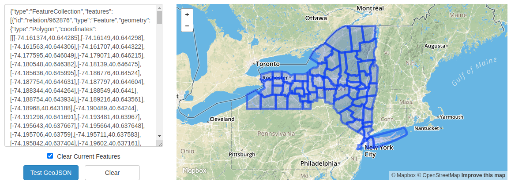
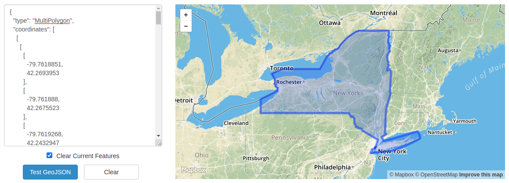

# GeoJSON
The missing GeoJSON utilities for OpenStreetMap


## Why this?
Because existing tools cannot solve below problems *efficiently*
- Building an OSM object in GeoJSON format with sub-areas separated. [osmtogeojson](https://github.com/tyrasd/osmtogeojson) or [polygons.openstreetmap.fr](http://polygons.openstreetmap.fr/get_geojson.py?id=relation_id) won't work because they don't include inner boundaries.
- Tags and metadata normalization
- Optional D3-compatibility. It doesn't follow common convetion like [winding order from GeoJSON’s RFC 7946](https://github.com/d3/d3-geo#d3-geo)

These above problems keep showing up and bugging me because my work is closely related. So if you share the same concerns, this tool is for you.

## Accuracy and Legal Disclaimer
The accuracy of information provided by the tool solely depends of [OpenStreetMap](https://www.openstreetmap.org/) data.

I do not accept any responsibility or liability for the accuracy, content, completeness, legality, or reliability of the information provided by the tool or contained on the website.

## Docs
### Installation
```
GO111MODULE=on go get -u github.com/hiendv/geojson/cmd/geojson
```

### Example
#### List all [New York](https://www.openstreetmap.org/relation/61320) sub-areas
```bash
geojson subarea 61320
```
```
2020-08-05T14:41:57.087+0700  INFO  fetching sub-areas   {"parent": 61320}
2020-08-05T14:42:06.126+0700  INFO  writing  {"path": "geojson/61320.geojson"}
2020-08-05T14:42:06.127+0700  INFO  sub-areas handled {"total": 62}
```

The difference with existing tools can be demonstrated with two visualization below

#### hiendv/geojson


#### polygons.openstreetmap.fr
*(after manual correction and right-hand-rule fixing)*


### Usage
```sh
geojson --help
```

```
NAME:
   GeoJSON - Utilities for OpenStreetMap GeoJSON

USAGE:
   geojson [global options] command [command options] [arguments...]

VERSION:
   0.1.0

AUTHOR:
   Hien Dao <hien.dv.neo@gmail.com>

COMMANDS:
   serve    serve the web server
   subarea  list all sub-areas of an OpenStreetMap object
   help, h  Shows a list of commands or help for one command

GLOBAL OPTIONS:
   --out value, -o value  specify the directory of outputs (default: "./geojson")
   --verbose              enable verbose logging with DEBUG level (default: false)
   --help, -h             show help (default: false)
   --version, -v          print the version (default: false)

COPYRIGHT:
   Copyright © 2020 Hien Dao. All Rights Reserved.
```

**Notice**: To print outputs to *stdout*, specify `--out` as an empty string
```
geojson --out "" command [command options] [arguments...]
```

### subarea
```sh
geojson subarea --help
```

```
NAME:
   geojson subarea - list all sub-areas of an OpenStreetMap object

USAGE:
   geojson subarea [command options] [arguments...]

OPTIONS:
   --raw, -r        leave tags in unfornalized form (UNF) (default: false)
   --separated, -s  leave sub-areas unmerged (default: false)
   --help, -h       show help (default: false)
```

### serve
```sh
geojson serve --help
```

```
NAME:
   geojson serve - serve the web server

USAGE:
   geojson serve [command options] [arguments...]

OPTIONS:
   --address value, --addr value  set the serving address (default: "127.0.0.1:8181")
   --origin value                 set the CORS origin (default: "*")
   --rate value                   set request-per-second for rate-limiting (default: 10)
   --rate-burst value             set burst size (concurrent requests) for rate-limiting (default: 5)
   --rate-ttl value               set the rate limit TTL for inactive sessions (default: "2m")
   --help, -h                     show help (default: false)
```

## Development
### Prerequisites
- go version go1.11 for [modules support](https://blog.golang.org/using-go-modules)

### Running and Building
```sh
go run cmd/geojson/main.go --help
go run cmd/geojson/main.go subarea --help
go run cmd/geojson/main.go serve --help

go build -o geojson cmd/geojson/main.go
```

### Linting & Formatting
```sh
### Format
gofumpt -w cmd internal pkg

### Lint
golangci-lint run ./...
```

### Testing
*coming soon*


## Contribution
Issues and PRs are welcome !

## License
[MIT](./LICENSE) &copy; 2020 Hien Dao <hien.dv.neo@gmail.com>